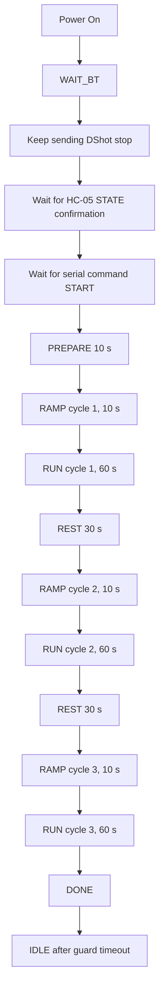
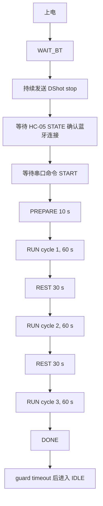

<div align="center">

# STM32_ESC_Dshot_E1

**STM32F103C8T6-based E1 test firmware for ESC steady-state comparison experiments**

**基于 `STM32F103C8T6` 的 E1 实验固件，用于 ESC 稳态对比测试**

<p>
  
  
  
  
  
</p>

</div>

---

## Table of Contents

- [English](#english)
  - [E1 Test Firmware](#e1-test-firmware)
  - [1. Project Purpose](#1-project-purpose)
  - [2. Current E1 Workflow](#2-current-e1-workflow)
  - [3. E1 State Machine](#3-e1-state-machine)
  - [4. DShot Command Strategy](#4-dshot-command-strategy)
  - [5. Bluetooth / Serial Control](#5-bluetooth--serial-control)
  - [6. Button Behavior](#6-button-behavior)
  - [7. OLED Display](#7-oled-display)
  - [8. FireWater / Serial Output](#8-firewater--serial-output)
  - [9. Analog Sampling and Current Chain](#9-analog-sampling-and-current-chain)
  - [10. Hardware Connections](#10-hardware-connections)
  - [11. CubeMX Notes](#11-cubemx-notes)
  - [12. Key Configurable Macros](#12-key-configurable-macros)
  - [13. Build](#13-build)
  - [14. Current Scope](#14-current-scope)
  - [15. E1-V2.0-DShot300 Update](#15-e1-v20-dshot300-update)
  - [16. E1-V3.0-DShot300 Update](#16-e1-v30-dshot300-update)
- [中文](#中文)
  - [E1 实验固件说明](#e1-实验固件说明)
  - [1. 项目用途](#1-项目用途)
  - [2. 当前 E1 实验流程](#2-当前-e1-实验流程)
  - [3. E1 状态机](#3-e1-状态机)
  - [4. DShot 命令策略](#4-dshot-命令策略)
  - [5. 蓝牙 / 串口控制](#5-蓝牙--串口控制)
  - [6. 按钮行为](#6-按钮行为)
  - [7. OLED 显示内容](#7-oled-显示内容)
  - [8. FireWater / 串口输出](#8-firewater--串口输出)
  - [9. 模拟采样与电流链](#9-模拟采样与电流链)
  - [10. 硬件连接](#10-硬件连接)
  - [11. CubeMX 配置要点](#11-cubemx-配置要点)
  - [12. 关键可调宏](#12-关键可调宏)
  - [13. 编译](#13-编译)
  - [14. 当前版本边界](#14-当前版本边界)
  - [15. E1-V2.0-DShot300 版本更新](#15-e1-v20-dshot300-版本更新)
  - [16. E1-V3.0-DShot300 版本更新](#16-e1-v30-dshot300-版本更新)

---

# English

## E1 Test Firmware

This repository contains the current E1 firmware used for ESC steady-state comparison work.

The firmware runs on a Blue Pill (`STM32F103C8T6`) board and acts as a lightweight experiment controller and data acquisition node.

It is intended for **steady-state operating point comparison**, especially for comparing different ESC variants under the same power supply, motor, propeller, and throttle-command conditions.

> [!NOTE]
> This README is organized in English first and Chinese second.  
> The technical content is kept consistent with the current repository description.

---

## 1. Project Purpose

This repository contains the current E1 firmware used on a Blue Pill (`STM32F103C8T6`) board.

The board acts as a lightweight experiment controller and data acquisition node for ESC comparison work.

### Main responsibilities

- output `DShot300` throttle to the ESC
- collect current and battery voltage using `ADC + DMA`
- communicate with the PC through an `HC-05` Bluetooth serial link
- display live status on a `1.3" I2C OLED`
- provide a simple local throttle-step button before test start

This E1 firmware is intended for **steady-state operating point comparison**, especially for comparing ESC variants under the same power supply, motor, propeller, and command conditions.

---

## 2. Current E1 Workflow

The current logic is:

1. power on
2. enter `WAIT_BT`
3. keep sending DShot `stop`
4. wait for Bluetooth link confirmation from `HC-05 STATE`
5. after Bluetooth is confirmed, wait for serial command `START`
6. enter `PREPARE` for 10 s
7. ramp cycle 1 from `E1_RAMP_START_DSHOT` to the selected throttle for 10 s
8. run cycle 1 at the selected fixed throttle for 60 s
9. rest at DShot stop for 30 s
10. ramp cycle 2 from `E1_RAMP_START_DSHOT` to the same throttle for 10 s
11. run cycle 2 at the same throttle for 60 s
12. rest at DShot stop for 30 s
13. ramp cycle 3 from `E1_RAMP_START_DSHOT` to the same throttle for 10 s
14. run cycle 3 at the same throttle for 60 s
15. enter `DONE`, then `IDLE` after the guard timeout

The MCU performs the timing locally. The PC side only needs to connect, choose the throttle with the button if needed, and send `START`.

### Workflow Diagram



---

## 3. E1 State Machine

State enum is defined in [`Core/Inc/app_e1_test.h`](./Core/Inc/app_e1_test.h):

- `STATE_WAIT_BT`
- `STATE_PREPARE`
- `STATE_RUN`
- `STATE_STOP`
- `STATE_DONE`
- `STATE_IDLE`

### Main entry points

- `E1_Test_Init()`
- `E1_Test_Task()`

### Core control implementation

- [`Core/Src/app_e1_test.c`](./Core/Src/app_e1_test.c)

---

## 4. DShot Command Strategy

The transport is `DShot300`.

### Current behavior

- `0` means stop
- valid throttle range is `48 ~ 2047`
- the current default run command is:
  - `E1_RUN_THROTTLE_DSHOT = 800`

Before the test starts, a local button can adjust the run throttle directly in raw DShot units.

---

## 5. Bluetooth / Serial Control

The current E1 firmware uses `HC-05` Bluetooth serial for experiment triggering and logging.

### Behavior

- `HC-05 STATE` is monitored as a Bluetooth connection indicator
- after connection is stable for `500 ms`, the firmware prints boot / ready messages
- the test starts only after receiving the serial command:

```text
START
```

### Supported characteristics

- case-insensitive parsing
- tolerant to optional newline behavior
- sends an ACK before entering prepare state

---

## 6. Button Behavior

The current button is used only before the test starts.

### Short press behavior

- valid in `WAIT_BT`
- only valid after Bluetooth is confirmed
- only valid before `START`
- each press increases the run throttle in raw DShot units

### Current step size

- `E1_RUN_THROTTLE_STEP_DSHOT = 100`

### Current range

- min: `48`
- max: `2047`

After reaching the maximum, it wraps back to the minimum.

---

## 7. OLED Display

The OLED shows 5 lines:

1. `VBAT`
2. `CURR`
3. `POWR`
4. current throttle setting
5. state-dependent timing information

### Typical line 5 content

- `PREP 09S`
- `RUN1 12S`
- `REST 28S`

### Additional visual prompt in `RUN`

- blink `R` around `25 ~ 30 s` in each run cycle as reminder for RPM measurement at 30 s
- blink `H` around `35 ~ 40 s` in each run cycle as reminder for hotspot / thermal measurement at 40 s

---

## 8. FireWater / Serial Output

The firmware outputs FireWater-compatible lines over UART so that tools such as VOFA can parse them.

### Current frame format

```text
h1:t_ms,state,cmd_raw,dshot_cmd,adc_i_raw,adc_vbat_raw,v_i_sense,v_vbat_adc,current_A,vbat_V,power_W,zero_offset_V,active_zero_offset_V,delta_i_V
```

Lines are terminated with `\r\n`.

The firmware also prints human-readable helper lines such as:

- `# boot`
- `# connected`
- `# waiting`
- `# ack`
- `# state_change`
- `# throttle_set`

---

## 9. Analog Sampling and Current Chain

### ADC acquisition

- `ADC1 + DMA`
- 2 channels
- circular mode
- averaged in firmware

### Channels

- `ADC1_IN0 / PA0`: INA199 output
- `ADC1_IN1 / PA1`: VBAT divider midpoint

### Derived values

- `v_i_sense`
- `v_vbat_adc`
- `current_A`
- `vbat_V`
- `power_W`
- `delta_i_V`
- `active_zero_offset_V`

### Current calculation path

```text
delta_i_V = v_i_sense - active_zero_offset_V
CURRENT_SCALE_A_PER_V = 1 / (INA199_GAIN_V_V * CURRENT_SHUNT_RESISTANCE_OHM)
current_A = delta_i_V * CURRENT_SCALE_A_PER_V
power_W   = current_A * vbat_V
```

Default hardware constants in this repo are now:

- `INA199_GAIN_V_V = 200` (INA199A3)
- `CURRENT_SHUNT_RESISTANCE_OHM = 0.00025`
- `CURRENT_SCALE_A_PER_V = 20`

Current polarity is currently set by:

- `E1_CURRENT_SIGN_INVERT = 0`

The firmware uses:

- `baseline_zero_offset_voltage`
- `active_zero_offset_voltage`

### Zero tracking behavior

- `WAIT_BT / PREPARE`: establish baseline zero offset
- `RUN`: freeze active zero
- `STOP`: delayed slow tracking
- `DONE`: continued slow tracking

---

## 10. Hardware Connections

- `PB8` -> ESC signal (`TIM4_CH3`, DShot300)
- `PA0` <- INA199 output (`ADC1_IN0`)
- `PA1` <- VBAT divider midpoint (`ADC1_IN1`)
- `PA9` -> HC-05 RXD (`USART1_TX`)
- `PA10` <- HC-05 TXD (`USART1_RX`)
- `PB12` <- HC-05 STATE
- `PB13` <- throttle adjust button, active-low, internal pull-up
- `PB6 / PB7` -> OLED (`I2C1`)
- `PC13` -> onboard status LED
- `PA13 / PA14` -> SWD

---

## 11. CubeMX Notes

Important assumptions for the current E1 project:

- `TIM4_CH3` on `PB8` for DShot output
- `USART1` enabled for HC-05 serial
- `PB12` configured as Bluetooth state input
- `PB13` configured as button input with pull-up
- `I2C1` on `PB6 / PB7`
- `ADC1` with 2-channel scan + DMA circular

### Critical timing requirement

- `TIM4` must stay in DShot configuration (`PSC=0`, `ARR=239`)

### Also ensure

- `DMA1_Channel5` interrupt is enabled for TIM4 CH3 DMA

---

## 12. Key Configurable Macros

Defined in [`Core/Inc/app_e1_test.h`](./Core/Inc/app_e1_test.h):

### Timing

- `E1_BT_PREPARE_MS`
- `E1_BT_CONNECT_CONFIRM_MS`
- `E1_RAMP_MS`
- `E1_RUN_MS`
- `E1_TEST_CYCLE_COUNT`
- `E1_REST_MS`
- `E1_SESSION_MAX_MS`
- `E1_CSV_INTERVAL_MS`

### UART / Bluetooth Robustness

- `E1_UART_BOOT_QUIET_MS`
- `E1_UART_TX_BUFFER_SIZE`

### DShot

- `E1_RUN_THROTTLE_DSHOT`
- `E1_RUN_THROTTLE_MIN_DSHOT`
- `E1_RUN_THROTTLE_MAX_DSHOT`
- `E1_RUN_THROTTLE_STEP_DSHOT`
- `E1_RAMP_START_DSHOT`
- `E1_DSHOT_SEND_INTERVAL_MS`

### Analog

- `VBAT_DIVIDER_RATIO`
- `INA199_GAIN_V_V`
- `CURRENT_SHUNT_RESISTANCE_OHM`
- `CURRENT_SCALE_A_PER_V`
- `E1_CURRENT_SIGN_INVERT`
- `E1_ZERO_TRACK_DELAY_MS`
- `E1_ZERO_TRACK_ALPHA_STOP`
- `E1_ZERO_TRACK_ALPHA_DONE`

### Safety

- `E1_CURRENT_TRIP_A`
- `E1_CURRENT_TRIP_HOLD_MS`

### Display

- `E1_OLED_UPDATE_INTERVAL_MS`
- `E1_OLED_I2C_TIMEOUT_MS`
- `E1_OLED_I2C_ADDR`
- `E1_OLED_COLUMN_OFFSET`

---

## 13. Build

### Example

```bash
cmake --preset Debug --fresh
cmake --build --preset Debug
```

### Expected outputs

- `build/Debug/STM32_ESC_DSHOT_E1.elf`
- `build/Debug/STM32_ESC_DSHOT_E1.hex`
- `build/Debug/STM32_ESC_DSHOT_E1.bin`

---

## 14. Current Scope

This repository currently represents the stabilized E1 steady-state experiment version.

It is intended for:

- fixed DShot operating point tests
- current / voltage / power logging
- OLED-assisted bench operation
- Bluetooth-triggered experiment start

It does **not** implement:

- RPM closed-loop control
- H2 step-response workflow and after experiments

---

## 15. E1-V2.0-DShot300 Update

This update finalizes a more flight-representative transport setup by changing the throttle protocol timing from `DShot500` to `DShot300`.

In addition, three bench-use improvements are included:

- OLED startup robustness is improved with delayed initialization and background retry, so the display no longer depends on a manual reset after power-up
- `power_W` is now calculated directly as `vbat_V * current_A`
- negative current results are clamped to `0`, preventing negative current and negative power values from appearing in the steady-state logs

This version is intended to be the `E1-V2.0-DShot300` milestone for the current steady-state ESC comparison workflow.

---

## 16. E1-V3.0-DShot300 Update

This release keeps `DShot300` and focuses on safer high-throttle bench testing.

Main changes:

- automatic 3-cycle test flow: each cycle ramps, runs for 60 s, and rests before the next cycle
- soft throttle ramp: each cycle starts from `E1_RAMP_START_DSHOT = 800` and reaches the selected throttle over `E1_RAMP_MS = 10000`
- serial output rate reduced to `E1_CSV_INTERVAL_MS = 1000` to reduce VOFA / Bluetooth buffer pressure
- UART output is non-blocking and old queued data is cleared when a new test starts
- Bluetooth reset / reconnect behavior is hardened to avoid unsolicited boot spam into VOFA
- over-current safety latch and forced DShot stop are enabled during both `RAMP` and `RUN`
- OLED I2C timeout is tuned for the 100 kHz bus while still avoiding long display-related stalls

The `1600` DShot target throttle point has been bench-verified with the ramped startup flow.

---

# 中文

## E1 实验固件说明

本仓库保存了当前用于 ESC 稳态对比实验的 E1 固件版本。

该固件运行在 Blue Pill（`STM32F103C8T6`）开发板上，作为一个轻量级实验控制器和数据采集节点使用。

它主要用于**稳态工况对比实验**，尤其适用于在相同电源、电机、螺旋桨和油门命令条件下，对不同 ESC 方案进行横向比较。

> [!NOTE]
> 本 README 采用先英文后中文的结构。  
> 具体技术内容保持与当前仓库描述一致。

---

## 1. 项目用途

这个仓库保存了当前 E1 实验所用的 Blue Pill（`STM32F103C8T6`）固件。

这块板子作为一个轻量级实验控制器和数据采集节点，服务于 ESC 对比实验。

### 主要职责

- 向 ESC 输出 `DShot300` 油门命令
- 通过 `ADC + DMA` 采集电流和电池电压
- 通过 `HC-05` 蓝牙串口和电脑通信
- 在 `1.3 寸 I2C OLED` 上显示实时状态
- 在测试开始前通过本地按钮调整待运行油门

这份 E1 固件的目标是做**稳态工况对比**，尤其适用于在相同电源、电机、桨和命令条件下比较不同 ESC 的表现。

---

## 2. 当前 E1 实验流程

当前逻辑流程如下：

1. 上电
2. 进入 `WAIT_BT`
3. 持续发送 DShot `stop`
4. 等待 `HC-05 STATE` 确认蓝牙已连接
5. 蓝牙确认后等待串口命令 `START`
6. 进入 `PREPARE`，持续 10 秒
7. 第 1 轮按选定固定油门运行 60 秒
8. DShot stop 休息 30 秒
9. 第 2 轮按同一油门运行 60 秒
10. DShot stop 休息 30 秒
11. 第 3 轮按同一油门运行 60 秒
12. 进入 `DONE`，保护超时后进入 `IDLE`

整个时序由 STM32 本地执行，PC 端只需要连上蓝牙、按需用按钮选油门，并发送 `START`。

### 流程图



---

## 3. E1 状态机

状态枚举定义在 [`Core/Inc/app_e1_test.h`](./Core/Inc/app_e1_test.h)：

- `STATE_WAIT_BT`
- `STATE_PREPARE`
- `STATE_RUN`
- `STATE_STOP`
- `STATE_DONE`
- `STATE_IDLE`

### 主入口函数

- `E1_Test_Init()`
- `E1_Test_Task()`

### 核心控制实现位于

- [`Core/Src/app_e1_test.c`](./Core/Src/app_e1_test.c)

---

## 4. DShot 命令策略

当前底层协议是 `DShot300`。

### 当前行为

- `0` 表示停机
- 有效油门范围为 `48 ~ 2047`
- 当前默认运行油门为：
  - `E1_RUN_THROTTLE_DSHOT = 800`

在测试正式开始之前，可以通过按钮直接以 DShot 原始值调整待运行油门。

---

## 5. 蓝牙 / 串口控制

当前 E1 版本使用 `HC-05` 蓝牙串口来完成实验触发和日志输出。

### 行为如下

- 监测 `HC-05 STATE` 作为蓝牙连接状态信号
- 当连接稳定保持 `500 ms` 后，固件会打印 boot / ready 提示
- 只有收到串口命令：

```text
START
```

才会真正开始实验

### 当前命令识别特性

- 大小写不敏感
- 对换行要求比较宽松
- 在进入准备阶段前会先返回 ACK

---

## 6. 按钮行为

当前按钮只用于测试开始前调整油门。

### 短按行为

- 只在 `WAIT_BT` 状态有效
- 只有蓝牙连接确认后才有效
- 只有在收到 `START` 之前有效
- 每按一次，待运行油门按 DShot 原始值增加一次

### 当前步进

- `E1_RUN_THROTTLE_STEP_DSHOT = 100`

### 当前范围

- 最小：`48`
- 最大：`2047`

超过上限后会循环回到最小值。

---

## 7. OLED 显示内容

OLED 当前显示 5 行：

1. `VBAT`
2. `CURR`
3. `POWR`
4. 当前油门设置
5. 状态相关的时间信息

### 第 5 行典型显示内容例如

- `PREP 09S`
- `RUN1 12S`
- `REST 28S`

### 在 `RUN` 状态下还有额外视觉提示

- 每轮 `RUN` 的 `25 ~ 30 s` 附近闪烁 `R`，提示 30 秒测速
- 每轮 `RUN` 的 `35 ~ 40 s` 附近闪烁 `H`，提示 40 秒测热点

---

## 8. FireWater / 串口输出

固件通过 UART 输出兼容 FireWater 的数据帧，便于 VOFA 等工具解析。

### 当前数据帧格式

```text
h1:t_ms,state,cmd_raw,dshot_cmd,adc_i_raw,adc_vbat_raw,v_i_sense,v_vbat_adc,current_A,vbat_V,power_W,zero_offset_V,active_zero_offset_V,delta_i_V
```

每行都以 `\r\n` 结束。

同时固件也会输出一些便于人工查看的辅助提示行，例如：

- `# boot`
- `# connected`
- `# waiting`
- `# ack`
- `# state_change`
- `# throttle_set`

---

## 9. 模拟采样与电流链

### ADC 采样方式

- `ADC1 + DMA`
- 双通道
- 循环模式
- 固件内做平均

### 采样通道

- `ADC1_IN0 / PA0`：INA199 输出
- `ADC1_IN1 / PA1`：VBAT 分压中点

### 导出量包括

- `v_i_sense`
- `v_vbat_adc`
- `current_A`
- `vbat_V`
- `power_W`
- `delta_i_V`
- `active_zero_offset_V`

### 当前电流计算路径

```text
delta_i_V = v_i_sense - active_zero_offset_V
CURRENT_SCALE_A_PER_V = 1 / (INA199_GAIN_V_V * CURRENT_SHUNT_RESISTANCE_OHM)
current_A = delta_i_V * CURRENT_SCALE_A_PER_V
power_W   = current_A * vbat_V
```

当前极性配置为：

- `E1_CURRENT_SIGN_INVERT = 0`

固件内部使用两套零点：

- `baseline_zero_offset_voltage`
- `active_zero_offset_voltage`

### 零点更新策略

- `WAIT_BT / PREPARE`：建立冷态基线
- `RUN`：冻结 active zero
- `STOP`：延时后慢速跟踪
- `DONE`：继续慢速跟踪

---

## 10. 硬件连接

- `PB8` -> ESC 信号输出（`TIM4_CH3`, DShot300）
- `PA0` <- INA199 输出（`ADC1_IN0`）
- `PA1` <- 电池分压中点（`ADC1_IN1`）
- `PA9` -> HC-05 RXD（`USART1_TX`）
- `PA10` <- HC-05 TXD（`USART1_RX`）
- `PB12` <- HC-05 STATE
- `PB13` <- 油门调整按钮，低电平按下有效，内部上拉
- `PB6 / PB7` -> OLED（`I2C1`）
- `PC13` -> 板载状态灯
- `PA13 / PA14` -> SWD 下载调试

---

## 11. CubeMX 配置要点

当前 E1 工程建议保持这些前提：

- `TIM4_CH3` on `PB8` for DShot output
- `USART1` enabled for HC-05 serial
- `PB12` configured as Bluetooth state input
- `PB13` configured as button input with pull-up
- `I2C1` on `PB6 / PB7`
- `ADC1` with 2-channel scan + DMA circular

### 最关键的时序要求

- `TIM4` 必须保持 DShot 配置（`PSC=0`, `ARR=239`）

### 另外还要确保

- `DMA1_Channel5` interrupt is enabled for TIM4 CH3 DMA

---

## 12. 关键可调宏

定义位置：[`Core/Inc/app_e1_test.h`](./Core/Inc/app_e1_test.h)

### 时序

- `E1_BT_PREPARE_MS`
- `E1_BT_CONNECT_CONFIRM_MS`
- `E1_RAMP_MS`
- `E1_RUN_MS`
- `E1_TEST_CYCLE_COUNT`
- `E1_REST_MS`
- `E1_SESSION_MAX_MS`
- `E1_CSV_INTERVAL_MS`

### 串口 / 蓝牙稳健性

- `E1_UART_BOOT_QUIET_MS`
- `E1_UART_TX_BUFFER_SIZE`

### DShot / 油门

- `E1_RUN_THROTTLE_DSHOT`
- `E1_RUN_THROTTLE_MIN_DSHOT`
- `E1_RUN_THROTTLE_MAX_DSHOT`
- `E1_RUN_THROTTLE_STEP_DSHOT`
- `E1_RAMP_START_DSHOT`
- `E1_DSHOT_SEND_INTERVAL_MS`

### 模拟量

- `VBAT_DIVIDER_RATIO`
- `INA199_GAIN_V_V`
- `CURRENT_SHUNT_RESISTANCE_OHM`
- `CURRENT_SCALE_A_PER_V`
- `E1_CURRENT_SIGN_INVERT`
- `E1_ZERO_TRACK_DELAY_MS`
- `E1_ZERO_TRACK_ALPHA_STOP`
- `E1_ZERO_TRACK_ALPHA_DONE`

### 安全保护

- `E1_CURRENT_TRIP_A`
- `E1_CURRENT_TRIP_HOLD_MS`

### 显示

- `E1_OLED_UPDATE_INTERVAL_MS`
- `E1_OLED_I2C_TIMEOUT_MS`
- `E1_OLED_I2C_ADDR`
- `E1_OLED_COLUMN_OFFSET`

---

## 13. 编译

### 编译示例

```bash
cmake --preset Debug --fresh
cmake --build --preset Debug
```

### 产物包括

- `build/Debug/STM32_ESC_DSHOT_E1.elf`
- `build/Debug/STM32_ESC_DSHOT_E1.hex`
- `build/Debug/STM32_ESC_DSHOT_E1.bin`

---

## 14. 当前版本边界

这个仓库当前对应的是已经稳定下来的 E1 稳态实验版本。

它主要适用于：

- 固定 DShot 工况测试
- 电流 / 电压 / 功率记录
- OLED 辅助台架操作
- 蓝牙触发实验开始

它**不包含**：

- RPM 闭环控制
- H2 阶跃响应流程以及后续实验

---

## 15. E1-V2.0-DShot300 版本更新

这次更新将油门协议时序从 `DShot500` 调整为 `DShot300`，使实验条件更接近日常飞行中常见的设置。

同时加入了 3 个更适合台架使用的改动：

- OLED 增加了上电延时初始化和后台重试机制，不再需要手动按复位后才亮屏
- `power_W` 现在直接按 `vbat_V * current_A` 计算
- 电流结果小于 `0` 时会强制钳到 `0`，避免稳态日志中出现负电流和负功率

这一版可作为当前稳态 ESC 对比流程的 `E1-V2.0-DShot300` 里程碑版本。

---

## 16. E1-V3.0-DShot300 版本更新

这一版继续使用 `DShot300`，重点优化高油门台架测试时的安全性和串口稳定性。

主要改动：

- 自动执行 3 轮测试流程：每轮先缓坡、再固定油门运行 60 秒，轮次之间休息
- 软启动油门缓坡：每轮从 `E1_RAMP_START_DSHOT = 800` 开始，在 `E1_RAMP_MS = 10000` 内推到选定油门
- 串口 CSV 输出间隔调整为 `E1_CSV_INTERVAL_MS = 1000`，降低 VOFA / 蓝牙缓存压力
- UART 输出改为非阻塞，新测试开始时会清掉旧的发送队列
- 加固蓝牙复位 / 重连行为，避免 MCU reset 后主动刷屏导致 VOFA 卡死
- `RAMP` 和 `RUN` 阶段都启用过流锁存保护和强制 DShot stop
- OLED I2C 超时按 100 kHz 总线重新调整，兼顾正常刷新和异常时不长时间卡主循环

`1600` DShot 目标油门已经使用缓坡启动流程完成台架验证。
